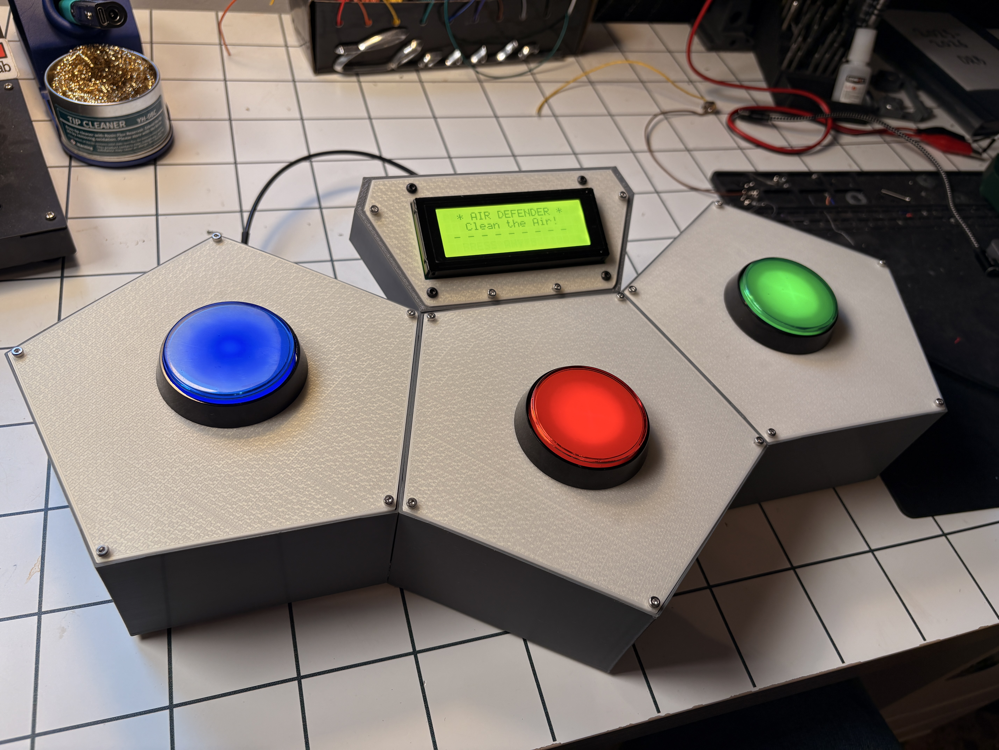
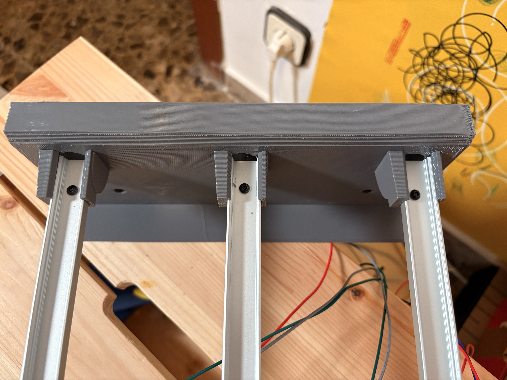
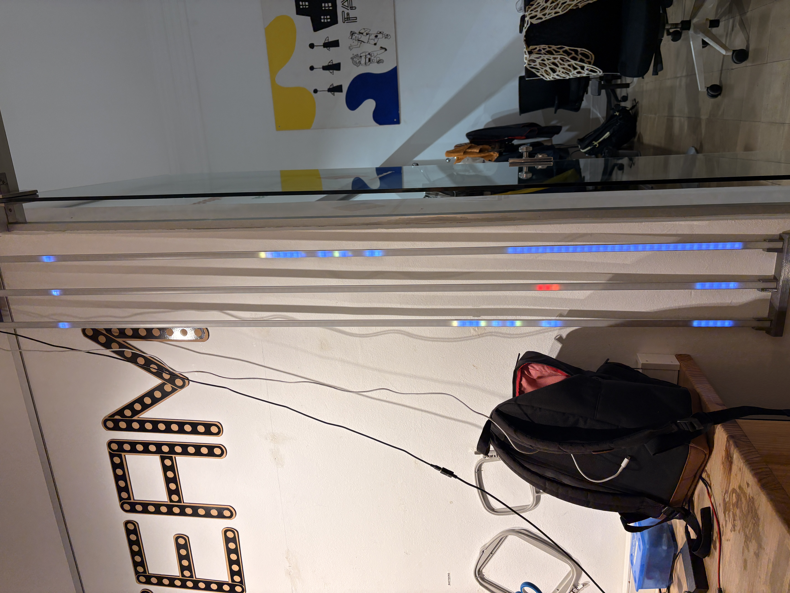
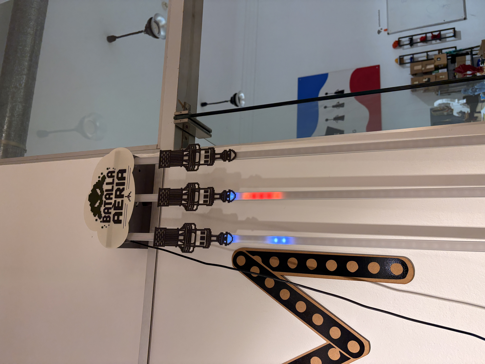
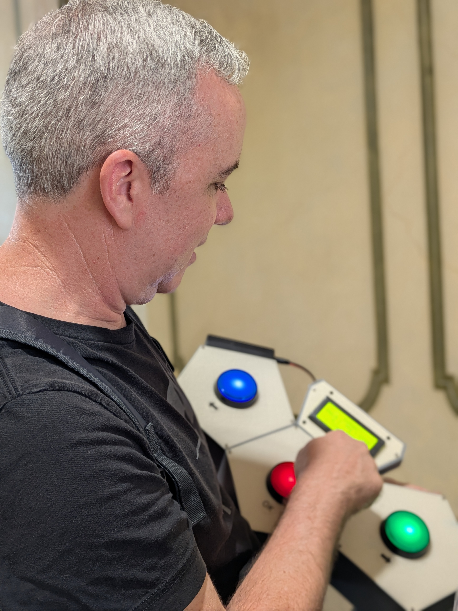
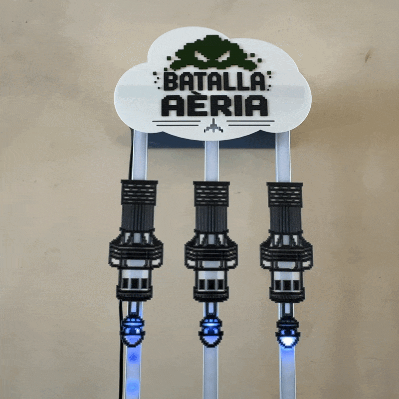

# Air Defender

Air Defender es un juego inalámbrico e interactivo sobre calidad del aire, diseñado para dos placas ESP32. Una placa funciona como consola del juego y escenario visual, mientras la otra actúa como controlador y interfaz del usuario. Juntas convierten datos reales de contaminación del aire en una experiencia arcade educativa y dinámica.

El proyecto comenzó con el nombre provisional de "1D Enviro Game", pero ahora se presenta como Air Defender.

> Esta página ofrece una versión en español del proyecto para facilitar la comprensión de quienes prefieren leer en este idioma.

## Vista previa visual



Controlador e interfaz LCD de Air Defender.



Tres carriles LED se iluminan según el estado de los contaminantes.



Demostración de instalación en pared.



Pantalla vertical completa con la marca Air Defender.



Jugadora usando el controlador para limpiar el aire.

## Demo

Mira una breve demostración de Air Defender en acción:

[](https://youtube.com/shorts/qmZg_ptcQ0Y?feature=share)

Haz clic en la vista previa animada para abrir el video completo en YouTube.

## ¿Qué hace el juego?

Air Defender convierte tres contaminantes principales en tres carriles jugables:

- PM2.5 (material particulado fino)
- NO2 (dióxido de nitrógeno)
- O3 (ozono troposférico)

Cada contaminante aparece como una tira LED luminosa ocupada por enemigos de contaminación. El jugador usa el controlador para disparar y limpiar el aire. Cuanto mejor elimine la contaminación de cada carril, más se limpia la ciudad.

## ¿Cómo funciona?

El juego se basa en una idea simple: los niveles de contaminación de una ciudad seleccionada se transforman en una batalla jugable. La placa de la consola muestra la partida visualmente mediante tres tiras LED, mientras la placa del controlador maneja la entrada, el texto, el audio y la experiencia general.

### Ciclo principal del juego

1. El controlador muestra la selección de ciudad y la pantalla de calidad del aire.
2. El jugador elige una ciudad y empieza la ronda.
3. Cada carril de contaminantes muestra una introducción educativa y la referencia de la guía de la OMS.
4. El jugador dispara a los enemigos con el botón correspondiente del controlador.
5. Mantener pulsado un botón carga un disparo más potente.
6. Si el jugador limpia la contaminación de los tres carriles, la ciudad se marca como rescatada.
7. Si la contaminación alcanza al héroe, la ronda termina en derrota.

## Sistema inalámbrico de dos placas

Una característica distintiva de Air Defender es su arquitectura de hardware dividida.

### Placa de consola

La placa de consola ejecuta la simulación principal del juego y las visualizaciones LED. Es responsable de:

- renderizar los tres carriles de contaminantes
- animar enemigos, chispas y efectos de victoria
- seguir el estado del juego y la progresión de la contaminación
- enviar información de estado de vuelta al controlador

### Placa de controlador

La placa de controlador es la interfaz visible para el jugador. Maneja:

- tres botones tipo arcade para disparar
- salida LCD y visualización de puntuación y estado
- reproducción de audio y señales sonoras
- comunicación inalámbrica con la consola
- un modo opcional de configuración por Wi-Fi para instalación y entrada de datos de ciudad

### Comunicación inalámbrica

Las dos placas se comunican mediante ESP-NOW, un protocolo inalámbrico de baja latencia ideal para una respuesta rápida del juego. Esto hace que el sistema se sienta como un único juego aunque use dos placas físicamente.

El controlador también puede entrar en un modo de configuración por punto de acceso para que el usuario pueda:

- configurar ajustes de Wi-Fi
- ajustar el idioma
- gestionar los datos AQI de las ciudades
- consultar y actualizar los valores de las ciudades desde un navegador

## Mecánicas del juego

### Carriles de contaminantes

Cada carril representa un reto ambiental diferente:

- PM2.5: polvo fino y contaminación por partículas
- NO2: contaminación relacionada con la combustión
- O3: ozono perjudicial en superficie

Cada tira usa un color y un comportamiento distintos, creando una sensación propia para cada contaminante.

### Disparo y carga

El controlador incluye un botón por carril de contaminante:

- botón azul para PM2.5
- botón rojo para NO2
- botón verde para O3

Un toque breve dispara un disparo estándar. Mantener pulsado el botón carga un disparo de cañón más potente que puede limpiar más contaminación a la vez.

### Capa educativa

El juego no es solo un shooter; también enseña sobre la calidad del aire. Antes de que empiece la batalla activa, muestra breves diapositivas educativas con:

- descripciones de los contaminantes
- impactos en la salud
- referencias a las guías seguras de la OMS

Esto convierte la experiencia en una herramienta educativa lúdica además de un juego.

## Soporte multilingüe

Air Defender incluye textos localizados para varios idiomas.

Idiomas compatibles:

- Inglés
- Español
- Catalán

El idioma seleccionado se puede cambiar mediante la interfaz de configuración del controlador y se guarda en la placa.

## Resumen de hardware

### Hardware de la consola

- M5Stack Atom S3 Lite
- Tres tiras LED para los carriles de contaminantes
- LED de estado integrado

### Hardware del controlador

- Adafruit QT Py ESP32-S3
- Tres botones tipo arcade
- Pantalla LCD I2C de 20x4
- Hardware de salida de audio
- Luz NeoPixel de estado integrada

## Compilar y subir

Este proyecto usa PlatformIO.

### Compilar todos los entornos

```bash
platformio run
```

### Subir el firmware de la consola

```bash
platformio run --target upload --environment console
```

### Subir el firmware del controlador

```bash
platformio run --target upload --environment controller
```

### Monitorizar la salida serie

```bash
platformio device monitor --environment console
```

o

```bash
platformio device monitor --environment controller
```

## Estructura del proyecto

- src/ contiene el firmware de la consola y del controlador
- include/ contiene configuración compartida, definiciones de protocolo y textos
- platformio.ini contiene la configuración de compilación para ambos entornos

## Notas

El juego usa valores de calidad del aire como base del diseño de los encuentros. En la práctica, esto significa que cada ciudad puede crear un reto diferente según su perfil de contaminación y la combinación de contaminantes seleccionada.

Este proyecto está pensado tanto como juego jugable como demostración de cómo los datos medioambientales pueden transformarse en una experiencia física interactiva.

---

Volver a la [versión en inglés](../index.md).
